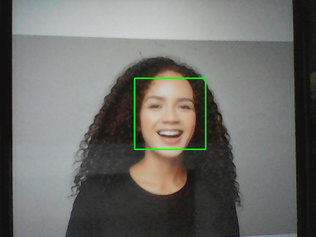

# OpenCV-Face-Detector

A simple **real-time face detection application** built using **Python** and **OpenCV**, with:  
✅ Mirror effect (like a selfie camera)  
✅ Resizable & fullscreen support  
✅ Press 'a' to exit  

---

## 📸 Demo  
The app uses your **webcam** to detect faces in real-time and draws a green rectangle around detected faces.  

## 📌 Example Output  

Here is a sample output of face detection:  


---

## 🚀 Features  
- Real-time face detection using Haar Cascade Classifier  
- Mirror effect for natural viewing  
- Resizable window (can maximize to fullscreen)  
- Simple and lightweight code  

---

## 🛠️ Installation  

1. Clone this repository:  
   ```bash
   git clone https://github.com/RaginiAG/OpenCV-Face-Detector.git
cd OpenCV-Face-Detector


   
